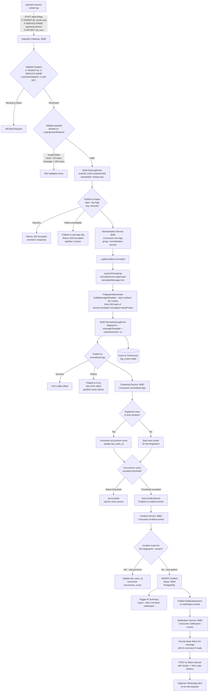
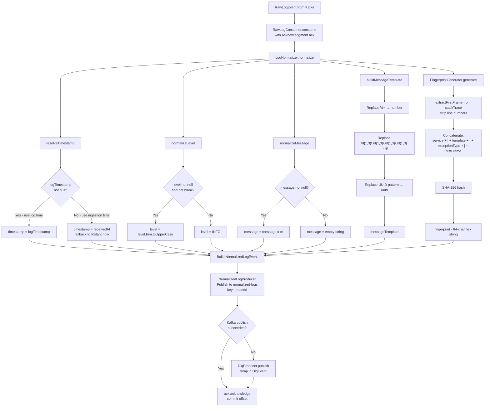
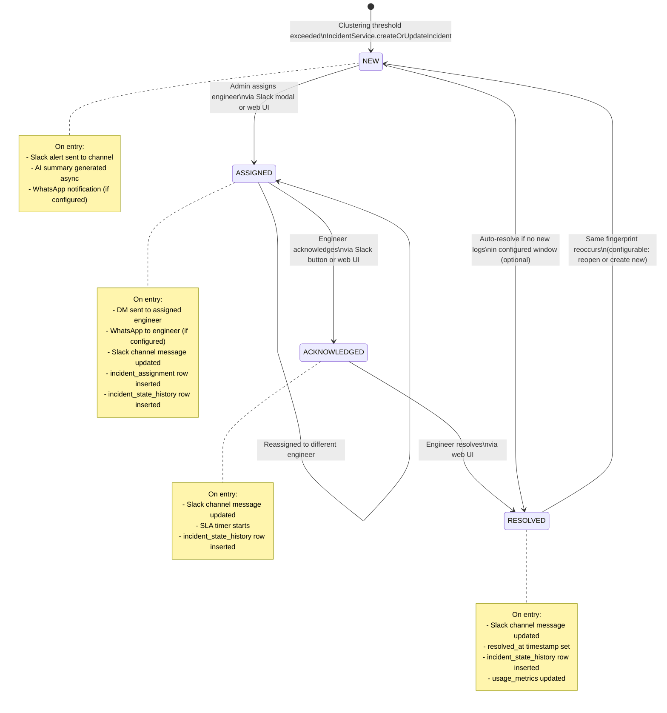
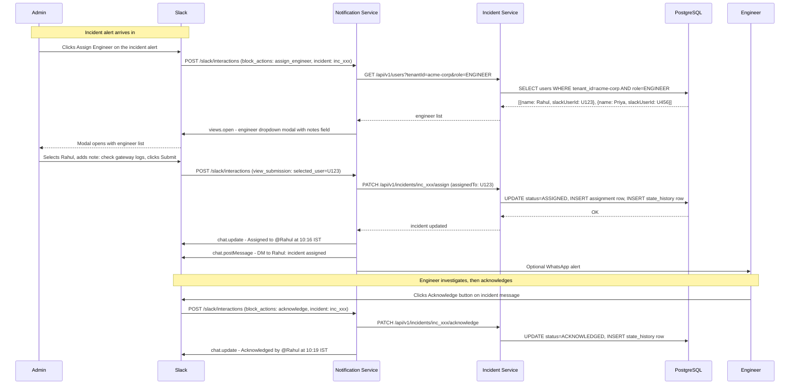
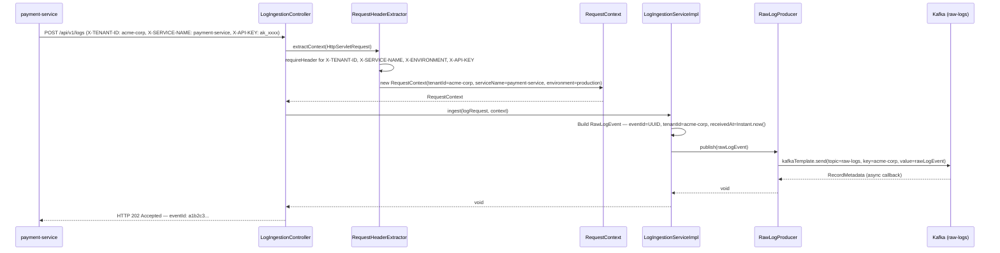
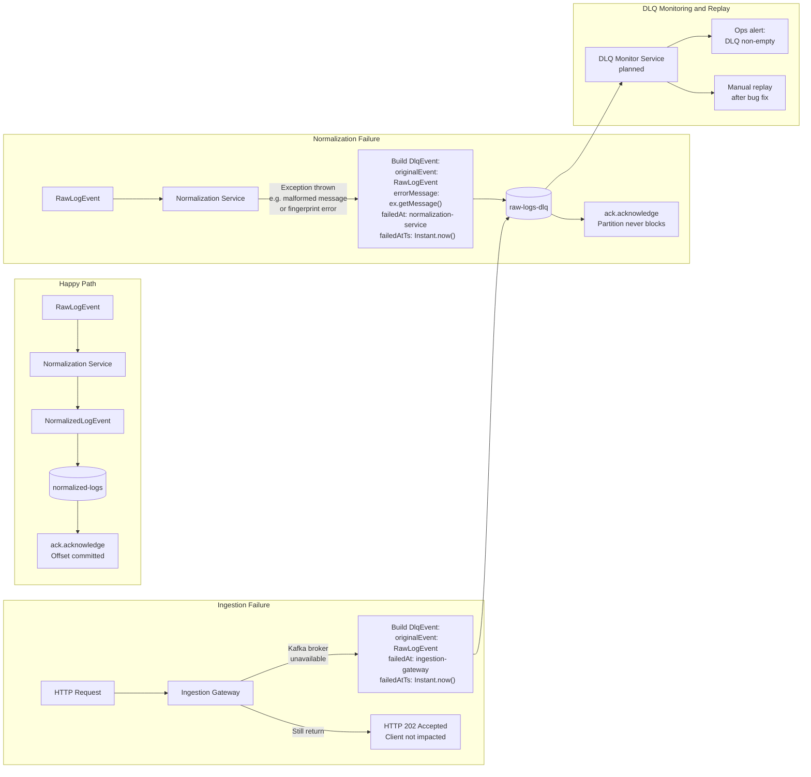
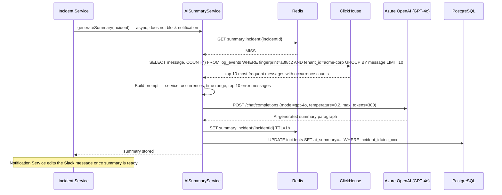

## The Golden Path

Before reading any diagram, understand the scenario they're all explaining.

---

**10:12 AM.** A new version of `payment-service` deploys to production. An environment variable is missing. Within seconds, every request to the payment processor throws:

```
ERROR  Connection timeout to payment-gateway after 30000ms
       at com.acme.PaymentProcessor.charge(PaymentProcessor.java:142)
       at com.acme.OrderService.placeOrder(OrderService.java:87)
```

Three pods. 800 requests per minute each. By 10:15 AM, **2,400 identical log lines** have been sent to log0's ingestion endpoint.

---

**What log0 does in those three minutes:**

1. Each of the 2,400 HTTP requests hits the Ingestion Gateway, is validated, wrapped in a `RawLogEvent`, and published to Kafka `raw-logs`. The gateway returns `202 Accepted` immediately - it does not wait for the pipeline.

2. The Normalization Service consumes each event from `raw-logs`. It normalizes the message, strips the dynamic port number from the timeout message, and generates a deterministic fingerprint:
   ```
   SHA-256("payment-service|Connection timeout to payment-gateway after <number>ms|ConnectionTimeoutException|PaymentProcessor.charge")
   → fingerprint: "a3f8c2..."
   ```

3. The Clustering Service accumulates `NormalizedLogEvents` with fingerprint `a3f8c2...`. After the first occurrence threshold is crossed (configurable), it emits a single `IncidentEvent` - 2,400 logs become 1 incident.

4. The Incident Service receives the `IncidentEvent`, writes a row to PostgreSQL with `status: NEW`, and asynchronously kicks off AI summarization. It then publishes a `NotificationEvent`.

5. The Notification Service formats a Slack Block Kit message and posts it to `#incidents`:

   ```
   🚨 CRITICAL  payment-service / production
   Connection timeout to payment-gateway after 30000ms
   2,400 occurrences since 10:12 AM

   AI Summary: The payment processor is failing to establish a
   connection to the downstream payment gateway. The timeout
   (30000ms) suggests the gateway is unreachable or overloaded.
   Likely cause: missing PAYMENT_GATEWAY_URL environment variable
   in the new deployment.

   [ Assign Engineer ]  [ View Logs ]
   ```

6. An admin clicks "Assign Engineer", selects Rahul from the dropdown, and adds a note. Rahul gets a DM. The incident status transitions to `ASSIGNED`. The Slack message updates.

**That is the complete system.** Every diagram below is a chapter of this story.

---

## End-to-End: Log to Incident

This diagram traces the full pipeline from the `payment-service` HTTP call to the Slack notification. Follow it top to bottom.



**Key observations:**

- The ingestion gateway always returns `202 Accepted` - even on Kafka failure. The pipeline is async by design. The client gets acknowledgment that the event was received, not that it was processed.
- ClickHouse receives every normalized log, not just incidents. This is what powers historical queries and the AI summary prompt.
- The Clustering Service is a stateful accumulator. Its time-window state is stored in Redis, making it horizontally scalable (multiple instances share the same window state).

---

## Log Normalization Detail

Normalization is where raw, inconsistent log text is transformed into a structured, query-ready event. The most important output is the `fingerprint` - the key that makes deduplication possible.

### Why Templating Works

Two log lines that differ only in dynamic values represent the same error:

```
"Connection timeout to payment-gateway after 30000ms"
"Connection timeout to payment-gateway after 28514ms"
"Connection timeout to payment-gateway after 31003ms"
```

After templating:

```
"Connection timeout to payment-gateway after <number>ms"
```

All three produce the same `messageTemplate`, and therefore the same `fingerprint`. 2,400 distinct log messages collapse to 1 incident.



**The fingerprint formula:**

```
fingerprint = SHA-256(
    serviceName + "|" +
    messageTemplate + "|" +
    exceptionType + "|" +    ← nullable, empty string if none
    firstStackFrame          ← first line of stack trace, line number stripped
)
```

Stripping line numbers from the stack frame means that a refactor which shifts `PaymentProcessor.java` from line 142 to line 145 does not create a new incident. The error is the same error.

---

## Incident Lifecycle State Machine

Every incident moves through exactly four states. Transitions are enforced by `IncidentStateMachine` - invalid transitions are rejected before they touch the database.



**Every transition is recorded.** The `incident_state_history` table receives a row for each state change, capturing who made the change and when. This gives a complete audit trail for post-incident review.

**Re-opening:** When a resolved incident's fingerprint appears again in new logs, the Clustering Service emits a new `IncidentEvent`. The Incident Service checks whether an open incident already exists for that fingerprint. If one does (e.g., someone resolved too early), `occurrence_count` is incremented and `last_seen_at` is updated. If none exists, a new incident is created from `NEW`.

---

## Slack Assignment Flow

The Slack integration is bidirectional. log0 posts alerts *to* Slack, and Slack sends interaction events *back* to log0. This sequence diagram shows an admin assigning an incident to an engineer entirely within Slack.



The entire assignment workflow - from alert to acknowledgment - happens without leaving Slack. Engineers do not need access to the web UI to handle incidents. The web UI exists for search, filtering, historical review, and bulk operations.

---

## Multi-Tenant Request Propagation

This sequence shows exactly how tenant context is extracted from the HTTP request and carried through to Kafka - tracing the internal call chain inside the Ingestion Gateway.



The `RequestHeaderExtractor.requireHeader()` method throws an `IllegalArgumentException` if any required header is missing or blank. The `GlobalExceptionHandler` catches this and returns a `400 Bad Request` with a structured error body. Tenant context is never assumed - it must be explicitly supplied on every request.

---

## DLQ: Failure Path and Recovery

The Dead Letter Queue pattern ensures that a processing failure never stalls the Kafka partition. This diagram shows both failure scenarios and how failed events can be replayed.



**The invariant:** The Kafka offset is *always* acknowledged, whether the message was processed successfully or forwarded to the DLQ. This guarantees that a bad message - a null field, a serialization failure, an unexpected format - does not halt processing for all messages behind it on the same partition.

**DLQ contents:** The `DlqEvent` wraps the full original event, so nothing is lost. When the underlying bug is fixed, failed messages can be replayed by re-publishing `originalEvent` to the head topic.

**Current gap:** The DLQ monitor service is not yet implemented. Today, DLQ activity is visible via Kafka consumer group metrics. The planned monitor will alert on non-empty DLQ lag and surface failed events in the web UI.

---

## AI Summary Generation

AI summarization is asynchronous and non-blocking. The incident is created and the notification is sent *before* the summary is ready. When the summary is written, the incident record is updated and the Slack message is edited to include it.



**Why `temperature: 0.2`?** Low temperature produces deterministic, factual summaries. High temperature produces creative writing. An SRE reading a Slack alert at 2 AM needs the former.

**Why cache the summary in Redis?** The summary is expensive to generate (LLM API call + ClickHouse query). If the same incident is re-opened or if the API is called multiple times, the cached result is returned instantly. The 1-hour TTL is a balance between freshness (the incident may accumulate new messages) and cost.

**What the query does:** The ClickHouse query fetches the ten most common distinct messages for this fingerprint. These are the raw log messages, not templated - they give the LLM specific text to work with, including the actual timeout durations, which may hint at the cause.
