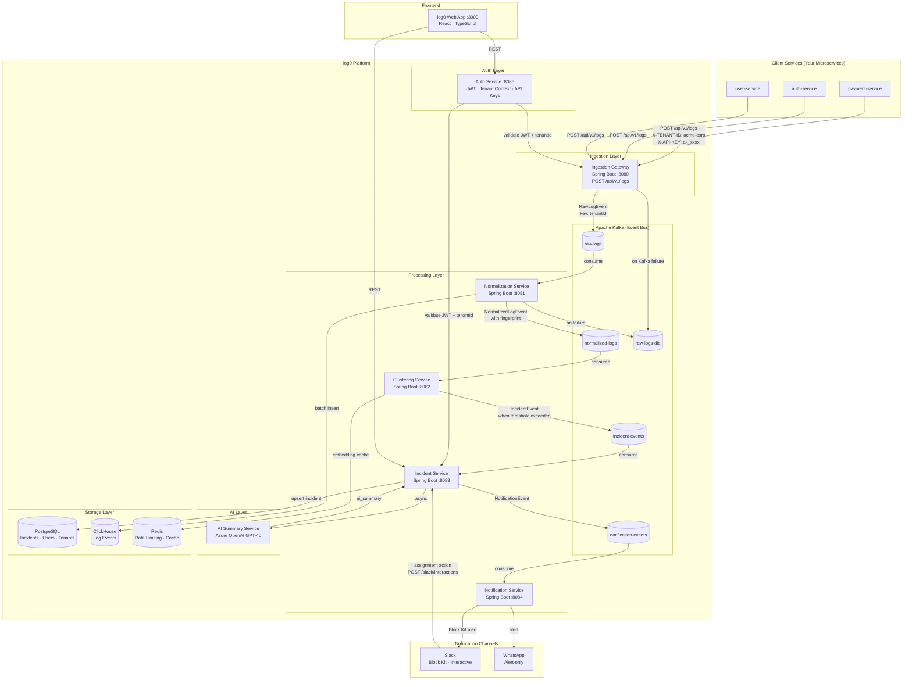
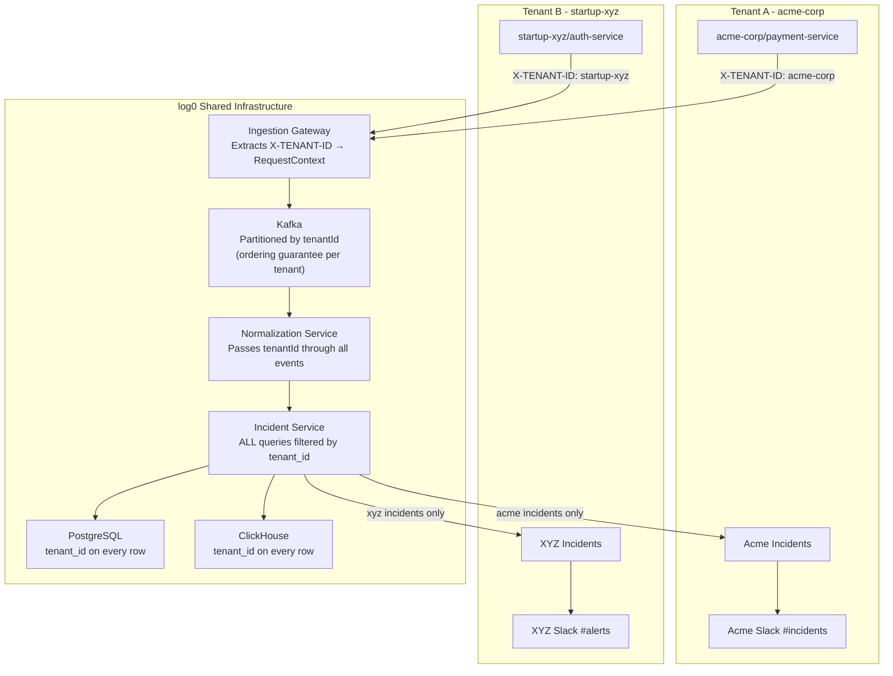
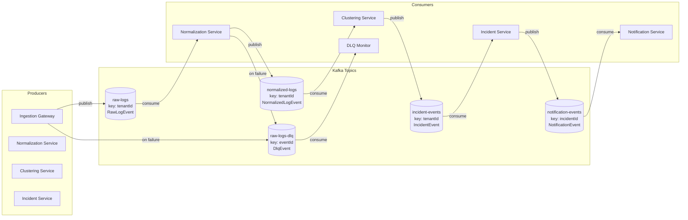
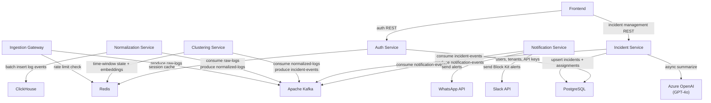

## What You're Looking At

log0 is a **linear pipeline disguised as a microservice platform**. A log enters at the left, an actionable incident exits at the right. Every service in between has exactly one job.

The core insight driving this design: **log processing is a stream transformation problem, not a request/response problem.** Kafka lets each stage run at its own pace, fail independently, and scale horizontally without coupling to its neighbors.

---

## Full Platform Architecture

### Reading the Diagram

The pipeline has two parallel outputs from normalization:

- **To `normalized-logs`** - the event continues downstream toward incident detection
- **To ClickHouse** - every normalized log is stored for historical queries and the AI summary prompt

This means ClickHouse receives *every* log that survives normalization, not just those that became incidents. Engineers can query raw log history even for errors that never crossed the incident threshold.

The Slack integration has a **feedback loop**: when an admin clicks "Assign Engineer" in a Slack message, the interaction webhook hits the Notification Service, which calls back into the Incident Service to update state. This is the only synchronous cross-service call in the data path.

---

## Multi-Tenant Architecture

Every log0 deployment is shared infrastructure. Multiple engineering teams (tenants) send logs to the same Kafka cluster, the same services, and the same databases - with strict data isolation enforced at every layer.

### How Isolation Works

Tenant context is established at the boundary (the `X-TENANT-ID` header) and carried through the entire pipeline as a first-class field on every event.

**Kafka isolation:** Kafka messages are keyed by `tenantId`. This routes all events for the same tenant to the same partition, guaranteeing that logs from a single tenant are processed in the order they were received. A burst from `acme-corp` does not affect `startup-xyz`'s partition.

**Storage isolation:** Every table in PostgreSQL has a `tenant_id` UUID column. Every log in ClickHouse has a `tenant_id` field. The Incident Service enforces `WHERE tenant_id = ?` on every query - the application layer reinforces what the data model mandates.

**No shared session state:** There is no in-memory state that mixes tenants. Each Kafka event is self-describing (it carries `tenantId`), so even if a consumer processes events from multiple tenants in the same batch, they are handled independently.

---

## Kafka Topics and Event Flow

Kafka is the connective tissue of log0. This diagram shows which service produces to which topic and which service consumes from it.

### Topic Design Decisions

**Why five topics instead of one?**

Each topic represents a discrete transformation in the pipeline. If you used a single topic, every consumer would receive raw logs and would need to independently normalize, cluster, and decide whether to create an incident. By separating topics, each service processes only the events it cares about at the maturity level it expects.

**Why is the DLQ key `eventId` and not `tenantId`?**

Downstream topics use `tenantId` as the key to guarantee per-tenant ordering. The DLQ is a recovery mechanism, not a processing pipeline - order between failed events from different tenants does not matter. Using `eventId` distributes failed events evenly across DLQ partitions and makes individual events easier to locate during replay.

**Why does `notification-events` use `incidentId` as the key?**

By the time a notification is published, the ordering that matters is per-incident, not per-tenant. Multiple notifications about the same incident (created, assigned, resolved) should land on the same partition so the Notification Service processes them in order and can update the Slack message correctly.

---

## Service Dependency Map

This graph shows which external systems each service depends on directly.

### Critical Path

The end-to-end critical path - from log ingestion to Slack notification - touches every service. The slowest link in this chain determines incident detection latency.

The two highest-latency operations are:
1. **Clustering window** - the Clustering Service accumulates events over a configurable time window before emitting an `IncidentEvent`. This window is tunable but introduces intentional lag.
2. **AI summary** - GPT-4o is called asynchronously after the incident is created. It does not block the notification; engineers see the incident in Slack before the summary arrives.

---

## Port Reference

| Service | Port | Protocol | Status |
|---|---|---|---|
| Ingestion Gateway | 8080 | HTTP | ✅ Implemented |
| Normalization Service | 8081 | - (Kafka only) | ✅ Implemented |
| Clustering Service | 8082 | - (Kafka only) | Planned |
| Incident Service | 8083 | HTTP + Kafka | Planned |
| Notification Service | 8084 | HTTP + Kafka | Planned |
| Auth Service | 8085 | HTTP | Planned |
| Frontend (Vite) | 3000 | HTTP | Planned |
| Kafka (external) | 9092 | TCP | ✅ Running |
| Kafka (internal/Docker) | 29092 | TCP | ✅ Running |
| Zookeeper | 2181 | TCP | ✅ Running |
| PostgreSQL | 5432 | TCP | Planned |
| ClickHouse (HTTP) | 8123 | HTTP | Planned |
| ClickHouse (native) | 9000 | TCP | Planned |
| Redis | 6379 | TCP | Planned |
