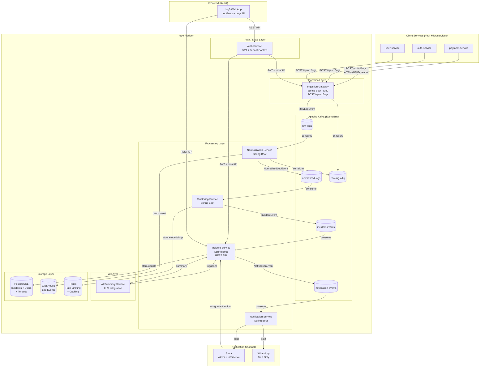

## High-Level System Architecture

```mermaid
graph TD
    subgraph Clients["Client Services (Your Microservices)"]
        C1[payment-service]
        C2[auth-service]
        C3[user-service]
    end

    subgraph log0["log0 Platform"]
        subgraph Ingestion["Ingestion Layer"]
            IG[Ingestion Gateway\nSpring Boot :8080\nPOST /api/v1/logs]
        end

        subgraph Kafka["Apache Kafka (Event Bus)"]
            T1[(raw-logs)]
            T2[(normalized-logs)]
            T3[(incident-events)]
            T4[(notification-events)]
            DLQ[(raw-logs-dlq)]
        end

        subgraph Processing["Processing Layer"]
            NS[Normalization Service\nSpring Boot]
            CS[Clustering Service\nSpring Boot]
            IS[Incident Service\nSpring Boot\nREST API]
            NOTIF[Notification Service\nSpring Boot]
        end

        subgraph AI["AI Layer"]
            AIS[AI Summary Service\nLLM Integration]
        end

        subgraph Storage["Storage Layer"]
            PG[(PostgreSQL\nIncidents + Users\n+ Tenants)]
            CH[(ClickHouse\nLog Events)]
            RD[(Redis\nRate Limiting\n+ Caching)]
        end

        subgraph Auth["Auth / SaaS Layer"]
            AS[Auth Service\nJWT + Tenant Context]
        end
    end

    subgraph Notifications["Notification Channels"]
        SL[Slack\nAlerts + Interactive]
        WA[WhatsApp\nAlert Only]
    end

    subgraph Frontend["Frontend (React)"]
        FE[log0 Web App\nIncidents + Logs UI]
    end

    C1 -->|POST /api/v1/logs\nX-TENANT-ID header| IG
    C2 -->|POST /api/v1/logs| IG
    C3 -->|POST /api/v1/logs| IG

    IG -->|RawLogEvent| T1
    IG -->|on failure| DLQ

    T1 -->|consume| NS
    NS -->|NormalizedLogEvent| T2
    NS -->|on failure| DLQ
    NS -->|batch insert| CH

    T2 -->|consume| CS
    CS -->|IncidentEvent| T3
    CS -->|store embeddings| RD

    T3 -->|consume| IS
    IS -->|store/update| PG
    IS -->|trigger AI| AIS
    AIS -->|summary| IS
    IS -->|NotificationEvent| T4

    T4 -->|consume| NOTIF
    NOTIF -->|alert| SL
    NOTIF -->|alert| WA

    SL -->|assignment action| IS

    AS -->|JWT + tenantId| IG
    AS -->|JWT + tenantId| IS

    FE -->|REST API| IS
    FE -->|REST API| AS
```
