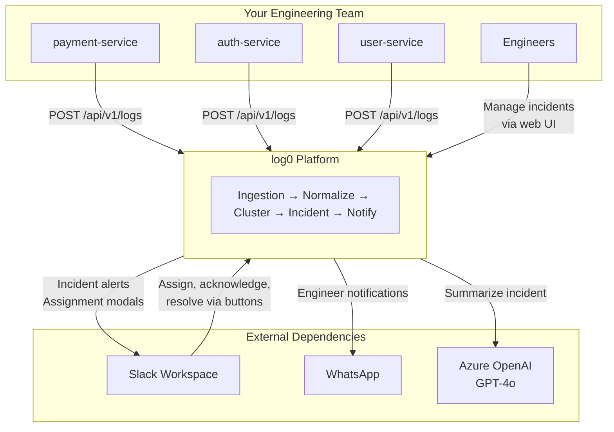

## What log0 Does

Modern microservice deployments generate thousands of log lines per second. When something breaks, the same error fires 10,000 times before anyone notices - and when they do, nobody knows whose problem it is.

log0 solves three compounding failures:

| Problem | log0's Answer |
|---|---|
| Alert fatigue - 10,000 identical errors | Fingerprinting + clustering → 1 incident |
| Unclear ownership | Slack-native assignment with engineer selection |
| Slow root cause | AI-generated summary attached at incident creation |

---

## System Context

This diagram shows log0's place in the world - what talks to it, what it depends on, and what it produces.

Your services send raw logs. log0 returns incidents with owners and AI summaries - no changes to your logging libraries, no agents to install.

---

## How These Docs Are Organized

These docs follow the [C4 model](https://c4model.com/) - four levels of zoom, each answering a different question.

<Cards>
  <Card title="System Design" href="/docs/architecture/high-level-system-architecture">
    **C4 Level 2 - Containers.** The full platform architecture: all services, Kafka topics, storage layers, and how they connect. Start here to understand what the system is made of.
  </Card>
  <Card title="Flow Diagrams" href="/docs/architecture/flow-diagrams">
    **Behavior.** What actually happens at runtime. Starts with a golden path walkthrough - a single error storm traced from HTTP request to Slack notification - then documents every sub-flow in detail.
  </Card>
  <Card title="Service Internals" href="/docs/architecture/lld-uml">
    **C4 Level 3 - Components.** Class diagrams, data models, and Kafka event schemas for every service. Reference when writing or reviewing implementation code.
  </Card>
  <Card title="Architecture Decisions" href="/docs/architecture/decisions">
    **Why.** Architecture Decision Records for every significant design choice - Kafka over alternatives, ClickHouse over Elasticsearch, deterministic fingerprinting over ML, and more.
  </Card>
</Cards>

---

## Design Principles

These five properties shape every decision in the platform. When a trade-off comes up, these are the tie-breakers.

**1. Zero blocking on failure**

A single bad log message must never stall the pipeline. Every Kafka consumer uses manual acknowledgment - the offset is only committed after successful processing *or* after the failed message is forwarded to the dead letter queue. Partitions never block.

**2. Tenant isolation is structural, not advisory**

Multi-tenancy is not a filter added at query time. Kafka messages are keyed by `tenantId` (enforcing per-tenant ordering at the partition level). Every database row carries `tenant_id`. A bug in the application layer cannot leak data between tenants; the infrastructure prevents it.

**3. Deterministic over probabilistic**

Incident deduplication is built on SHA-256 fingerprints, not ML clustering or fuzzy matching. Given the same error pattern, the same fingerprint is always produced - no training data, no drift, no threshold tuning. The trade-off is that genuinely novel log formats may not template cleanly; the benefit is total reproducibility.

**4. Services share nothing except event contracts**

Services communicate exclusively through Kafka topics. No shared databases, no synchronous service-to-service calls in the data path. Each service can be deployed, scaled, or restarted independently. The only coupling is the event schema, which is versioned (`schemaVersion: "v1"`).

**5. At-least-once delivery, idempotent consumers**

Producers are configured with `acks=all`, `retries=3`, and `enable.idempotence=true`. Consumers use manual ACK. The system may process the same message more than once under failure; every consumer is designed to handle duplicates gracefully (idempotent upserts in the incident service, fingerprint-based dedup in clustering).

---

## Performance Targets

These are the design-time targets for a single-instance deployment.

| Metric | Target |
|---|---|
| Log ingestion throughput | 10,000 logs/second |
| Normalization latency (p99) | < 50ms per event |
| Fingerprint generation | < 1ms |
| Incident detection lag | < 30 seconds from first log |
| Kafka consumer lag target | < 1,000 messages |
| Deduplication ratio | Up to 10,000:1 |

---

## Infrastructure at a Glance

| Component | Technology | Role |
|---|---|---|
| Language | Java 25 | All backend services |
| Framework | Spring Boot 4.0.2 | Web, Kafka, validation |
| Event bus | Apache Kafka (Confluent 7.5.0) | Inter-service communication |
| Log storage | ClickHouse | High-volume analytical queries |
| Incident storage | PostgreSQL | ACID transactions, relational state |
| Cache / state | Redis | Rate limiting, clustering windows, LLM cache |
| AI summaries | Azure OpenAI (GPT-4o) | Incident summarization |
| Notifications | Slack Block Kit + WhatsApp | Engineer alerts and actions |
| Build | Maven + Docker | Service builds and local infra |
