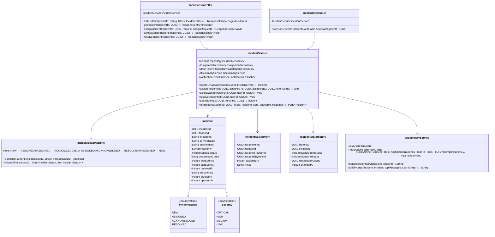
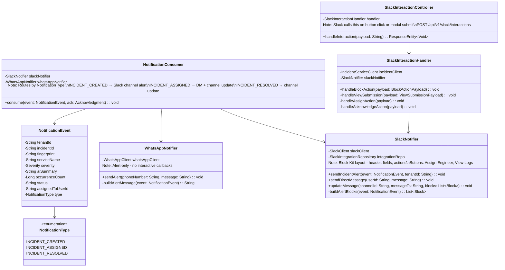
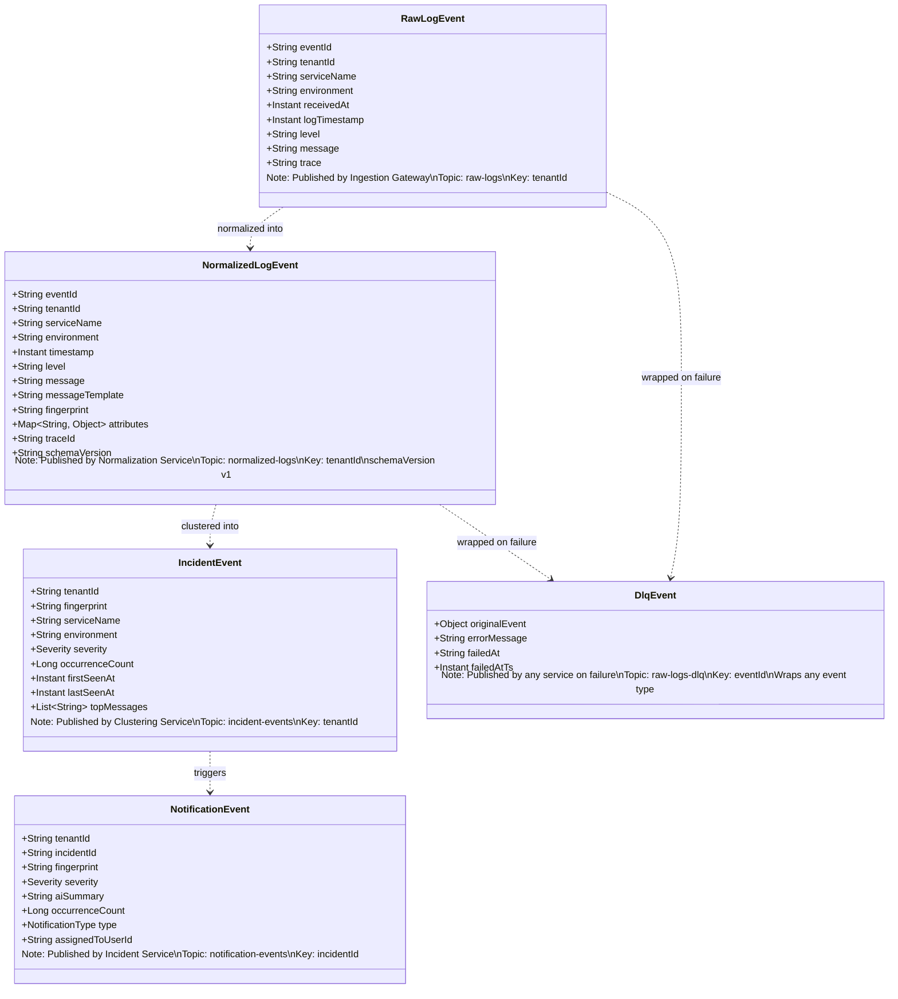
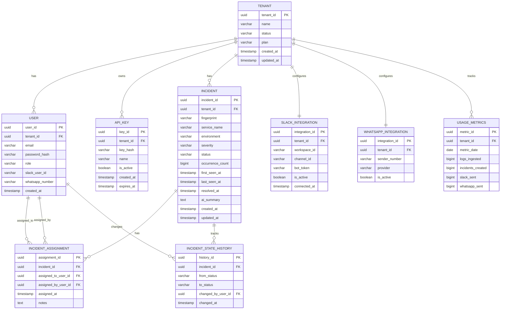
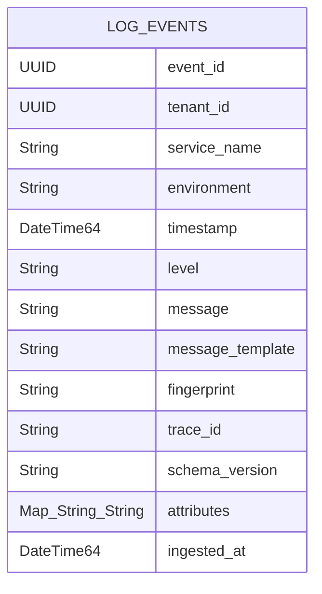

## What This Section Covers

This section documents the internal structure of each service - the classes, their relationships, and the design decisions behind them. Use this as a reference when reading, writing, or reviewing implementation code.

**Implementation status as of March 2026:**

| Service | Status | Notes |
|---|---|---|
| Ingestion Gateway | ✅ ~85% complete | REST API, Kafka producer, DLQ all working |
| Normalization Service | ✅ ~80% complete | Normalization and fingerprinting complete; producer reliability config pending |
| Clustering Service | 🔄 Designed | LLD complete; implementation next |
| Incident Service | Planned | Not yet started |
| Notification Service | Planned | Not yet started |
| Auth Service | Planned | Not yet started |

---

## Ingestion Gateway

**Responsibility:** Accept log events from client services over HTTP, validate them, and publish them to Kafka. Return immediately - the gateway's job ends at `202 Accepted`. It has no downstream dependencies except Kafka and Redis (rate limiting, planned).

**Key design decisions:**
- HTTP entry point is synchronous; Kafka publish is asynchronous with a completion callback
- On Kafka failure, the DLQ is published from within the async callback - the HTTP response is already `202` before the failure is known
- All tenant context comes from HTTP headers, never from the request body. The body is the log event only.

```mermaid
classDiagram
    class LogIngestionController {
        -LogIngestionService ingestionService
        -RequestHeaderExtractor headerExtractor
        +ingestLog(httpRequest: HttpServletRequest, logRequest: LogIngestionRequest): ResponseEntity~Void~
    }

    class LogIngestionService {
        <<interface>>
        +ingest(request: LogIngestionRequest, context: RequestContext): void
    }

    class LogIngestionServiceImpl {
        -RawLogProducer rawLogProducer
        -DlqProducer dlqProducer
        +ingest(request: LogIngestionRequest, context: RequestContext): void
    }

    class LogIngestionRequest {
        -Instant timestamp
        -String level
        -String message
        -String trace
        Note: @NotNull timestamp, @NotBlank level max 20,\n@NotBlank message max 10000, trace optional max 100000
    }

    class RawLogEvent {
        -String eventId
        -String tenantId
        -String serviceName
        -String environment
        -Instant receivedAt
        -Instant logTimestamp
        -String level
        -String message
        -String trace
        Note: @Builder @Getter
    }

    class RequestContext {
        -String tenantId
        -String serviceName
        -String environment
        -String apiKey
        Note: Immutable holder - extracted once per request
    }

    class RequestHeaderExtractor {
        +extract(request: HttpServletRequest): RequestContext
        -requireHeader(request: HttpServletRequest, name: String): String
        Note: Throws IllegalArgumentException on missing header
    }

    class RawLogProducer {
        -KafkaTemplate~String, RawLogEvent~ kafkaTemplate
        -DlqProducer dlqProducer
        +publish(event: RawLogEvent): void
        Note: key = tenantId\nDLQ on async callback failure
    }

    class DlqProducer {
        -KafkaTemplate~String, DlqEvent~ kafkaTemplate
        +publish(key: String, event: DlqEvent): void
    }

    class DlqEvent {
        -Object originalEvent
        -String errorMessage
        -String failedAt
        -Instant failedAtTs
        Note: @Builder @Getter
    }

    class GlobalExceptionHandler {
        +handleValidationException(ex: MethodArgumentNotValidException): ResponseEntity
        +handleIllegalArgumentException(ex: IllegalArgumentException): ResponseEntity
        +handleGenericException(ex: Exception): ResponseEntity
    }

    class ErrorResponse {
        -String error
        -List~String~ details
    }

    class KafkaProducerConfig {
        +rawLogProducerFactory(): ProducerFactory~String, RawLogEvent~
        +rawLogKafkaTemplate(): KafkaTemplate~String, RawLogEvent~
        +dlqProducerFactory(): ProducerFactory~String, DlqEvent~
        +dlqKafkaTemplate(): KafkaTemplate~String, DlqEvent~
        Note: acks=all, retries=3,\nenable.idempotence=true, linger.ms=5
    }

    class RawLogEventSerializer {
        -ObjectMapper objectMapper
        +serialize(topic: String, data: RawLogEvent): byte[]
        Note: Uses tools.jackson 3.x (Jackson 3)\nnot com.fasterxml.jackson
    }

    class DlqEventSerializer {
        -ObjectMapper objectMapper
        +serialize(topic: String, data: DlqEvent): byte[]
        Note: Uses com.fasterxml.jackson 2.x
    }

    LogIngestionController --> LogIngestionService
    LogIngestionController --> RequestHeaderExtractor
    LogIngestionServiceImpl ..|> LogIngestionService
    LogIngestionServiceImpl --> RawLogProducer
    LogIngestionServiceImpl --> RawLogEvent : builds
    RequestHeaderExtractor --> RequestContext : creates
    RawLogProducer --> RawLogEvent
    RawLogProducer --> DlqProducer : on failure
    DlqProducer --> DlqEvent
    GlobalExceptionHandler --> ErrorResponse
    KafkaProducerConfig --> RawLogEventSerializer
    KafkaProducerConfig --> DlqEventSerializer
```

**Note on the two Jackson versions:** `RawLogEventSerializer` uses `tools.jackson` (Jackson 3.x, co-packaged with Spring Boot 4.0.2), while `DlqEventSerializer` uses `com.fasterxml.jackson` (Jackson 2.x). This is intentional - full control over each serializer's behavior without relying on Spring's auto-configuration to manage both.

---

## Normalization Service

**Responsibility:** Consume `RawLogEvents` from Kafka, transform them into a canonical schema, generate a deterministic fingerprint, and publish `NormalizedLogEvents` to the next topic. Also writes every normalized event to ClickHouse for historical storage.

**Key design decisions:**
- Manual Kafka acknowledgment - offset committed only after successful publish *or* DLQ fallback. The partition never blocks.
- `FingerprintGenerator` is designed as a separate `@Component` so it can be unit-tested independently of the normalization pipeline.
- `schemaVersion: "v1"` field on every event enables future schema evolution without breaking existing consumers.

```mermaid
classDiagram
    class RawLogConsumer {
        -LogNormalizer normalizer
        -NormalizedLogProducer producer
        -DlqProducer dlqProducer
        +consume(event: RawLogEvent, ack: Acknowledgment): void
        Note: @KafkaListener topics=raw-logs\ngroup=normalization-service\nManual ACK mode
    }

    class LogNormalizer {
        -FingerprintGenerator fingerprintGenerator
        +normalize(raw: RawLogEvent): NormalizedLogEvent
        -resolveTimestamp(raw: RawLogEvent): Instant
        -normalizeLevel(level: String): String
        -normalizeMessage(message: String): String
        -extractAttributes(raw: RawLogEvent): Map~String, Object~
        -buildMessageTemplate(message: String): String
        Note: buildMessageTemplate delegates to FingerprintGenerator.buildMessageTemplate\nextractAttributes returns empty HashMap (placeholder)
    }

    class FingerprintGenerator {
        -Pattern UUID_PATTERN
        -Pattern NUMBER_PATTERN
        -Pattern IP_PATTERN
        +buildMessageTemplate(message: String): String
        +generate(service: String, template: String, exceptionType: String, stackTrace: String): String
        -extractFirstFrame(stackTrace: String): String
        -sha256(input: String): String
        -safe(s: String): String
    }

    class NormalizedLogEvent {
        -String eventId
        -String tenantId
        -String serviceName
        -String environment
        -Instant timestamp
        -String level
        -String message
        -String messageTemplate
        -String fingerprint
        -Map~String, Object~ attributes
        -String traceId
        -String schemaVersion
        Note: @Builder @Getter\nschemaVersion fixed at v1
    }

    class RawLogEvent {
        -String eventId
        -String tenantId
        -String serviceName
        -String environment
        -Instant receivedAt
        -Instant logTimestamp
        -String level
        -String message
        -String trace
        Note: @Data - deserialization target\nMirrored from ingestion-gateway DTO
    }

    class NormalizedLogProducer {
        -KafkaTemplate~String, NormalizedLogEvent~ kafkaTemplate
        +publish(event: NormalizedLogEvent): void
        Note: key = tenantId
    }

    class DlqProducer {
        -KafkaTemplate~String, DlqEvent~ kafkaTemplate
        +publish(key: String, event: DlqEvent): void
    }

    class KafkaConsumerConfig {
        +consumerFactory(): ConsumerFactory~String, RawLogEvent~
        +kafkaListenerContainerFactory(): ConcurrentKafkaListenerContainerFactory
        Note: enable-auto-commit: false\nack-mode: MANUAL\ngroup: normalization-service
    }

    class KafkaProducerConfig {
        +producerFactory(): ProducerFactory~String, NormalizedLogEvent~
        +kafkaTemplate(): KafkaTemplate~String, NormalizedLogEvent~
        +dlqProducerFactory(): ProducerFactory~String, DlqEvent~
        +dlqKafkaTemplate(): KafkaTemplate~String, DlqEvent~
        Note: acks=all, retries=3,\nenable.idempotence=true, linger.ms=5
    }

    class RawLogEventDeserializer {
        -ObjectMapper objectMapper
        +deserialize(topic: String, data: byte[]): RawLogEvent
        Note: Uses com.fasterxml.jackson 2.x\nThrows SerializationException on failure
    }

    class NormalizedLogEventSerializer {
        -ObjectMapper objectMapper
        +serialize(topic: String, data: NormalizedLogEvent): byte[]
        Note: Uses com.fasterxml.jackson 2.x
    }

    RawLogConsumer --> LogNormalizer
    RawLogConsumer --> NormalizedLogProducer
    RawLogConsumer --> DlqProducer
    RawLogConsumer --> RawLogEvent : consumes
    LogNormalizer --> FingerprintGenerator
    LogNormalizer --> NormalizedLogEvent : produces
    NormalizedLogProducer --> NormalizedLogEvent
    KafkaConsumerConfig --> RawLogEventDeserializer
    KafkaProducerConfig --> NormalizedLogEventSerializer
```

---

## Clustering Service

**Responsibility:** Consume `NormalizedLogEvents` from Kafka, group them by fingerprint within a time window, and publish an `IncidentEvent` to `incident-events` when the occurrence threshold is crossed. Continues publishing updates on every subsequent match so the Incident Service can track `occurrenceCount` and `lastSeenAt` in real time.

**Key design decisions:**
- `OccurrenceStore` is an interface — `FingerprintClusterer` never touches storage directly. Swapping in-memory for Redis later requires changing one class, not the clusterer.
- Tumbling window (fixed 5-min buckets) chosen over sliding window for MVP simplicity — a burst of errors will cross the threshold regardless of window style.
- Threshold and window duration are externalised into `ClusteringConfig` so they can be tuned without a code change.
- `topMessages` collected per window — capped at 10 distinct values. Used later by the AI Summary Service to build its prompt.

```mermaid
classDiagram
    class NormalizedLogConsumer {
        -FingerprintClusterer clusterer
        -DlqProducer dlqProducer
        +consume(event: NormalizedLogEvent, ack: Acknowledgment): void
        Note: @KafkaListener topics=normalized-logs\ngroup=clustering-service\nManual ACK mode
    }

    class FingerprintClusterer {
        -OccurrenceStore occurrenceStore
        -IncidentEventProducer producer
        -ClusteringConfig config
        -SeverityResolver severityResolver
        +cluster(event: NormalizedLogEvent): void
        -buildClusterKey(event: NormalizedLogEvent): ClusterKey
        -buildIncidentEvent(key: ClusterKey, window: OccurrenceWindow, event: NormalizedLogEvent): IncidentEvent
        Note: Fires IncidentEvent at threshold (occurrence 10)\nKeeps firing on every subsequent event\nto update occurrenceCount + lastSeenAt in Incident Service
    }

    class OccurrenceStore {
        <<interface>>
        +increment(key: ClusterKey, message: String): OccurrenceWindow
        +get(key: ClusterKey): OccurrenceWindow
        Note: Interface — swap InMemoryOccurrenceStore for\nRedisOccurrenceStore without changing FingerprintClusterer
    }

    class InMemoryOccurrenceStore {
        -ConcurrentHashMap~ClusterKey, OccurrenceWindow~ store
        +increment(key: ClusterKey, message: String): OccurrenceWindow
        +get(key: ClusterKey): OccurrenceWindow
        Note: TODO future - replace with RedisOccurrenceStore\nfor counter persistence across restarts\nand shared state across multiple instances
    }

    class ClusterKey {
        -String tenantId
        -String fingerprint
        -String windowBucket
        Note: windowBucket = timestamp truncated to 5-min boundary\nTumbling window: 10:00 10:05 10:10...\nTODO future: extract WindowStrategy interface for sliding window support
    }

    class OccurrenceWindow {
        -long count
        -Instant firstSeenAt
        -Instant lastSeenAt
        -List~String~ topMessages
        Note: topMessages capped at 10 distinct values\nUsed to build AI summary prompt in Phase 6
    }

    class ClusteringConfig {
        -int occurrenceThreshold
        -int windowDurationMinutes
        -int maxTopMessages
        Note: occurrenceThreshold default 10\nwindowDurationMinutes default 5\nmaxTopMessages default 10\nAll configurable via application.yml
    }

    class SeverityResolver {
        +resolve(level: String): Severity
        Note: ERROR or FATAL → HIGH\nWARN → MEDIUM\nINFO or DEBUG → LOW
    }

    class IncidentEvent {
        -String tenantId
        -String fingerprint
        -String serviceName
        -String environment
        -Severity severity
        -Long occurrenceCount
        -Instant firstSeenAt
        -Instant lastSeenAt
        -List~String~ topMessages
        Note: @Builder @Getter\nPublished to incident-events\nKey: tenantId
    }

    class IncidentEventProducer {
        -KafkaTemplate~String, IncidentEvent~ kafkaTemplate
        +publish(event: IncidentEvent): void
        Note: key = tenantId
    }

    class DlqProducer {
        -KafkaTemplate~String, DlqEvent~ kafkaTemplate
        +publish(key: String, event: DlqEvent): void
    }

    class KafkaConsumerConfig {
        +consumerFactory(): ConsumerFactory~String, NormalizedLogEvent~
        +kafkaListenerContainerFactory(): ConcurrentKafkaListenerContainerFactory
        Note: enable-auto-commit: false\nack-mode: MANUAL\ngroup: clustering-service
    }

    class KafkaProducerConfig {
        +incidentEventProducerFactory(): ProducerFactory~String, IncidentEvent~
        +incidentEventKafkaTemplate(): KafkaTemplate~String, IncidentEvent~
        +dlqProducerFactory(): ProducerFactory~String, DlqEvent~
        +dlqKafkaTemplate(): KafkaTemplate~String, DlqEvent~
        Note: acks=all, retries=3,\nenable.idempotence=true
    }

    class NormalizedLogEventDeserializer {
        -ObjectMapper objectMapper
        +deserialize(topic: String, data: byte[]): NormalizedLogEvent
        Note: Uses com.fasterxml.jackson 2.x
    }

    class IncidentEventSerializer {
        -ObjectMapper objectMapper
        +serialize(topic: String, data: IncidentEvent): byte[]
        Note: Uses com.fasterxml.jackson 2.x
    }

    NormalizedLogConsumer --> FingerprintClusterer
    NormalizedLogConsumer --> DlqProducer
    FingerprintClusterer --> OccurrenceStore
    FingerprintClusterer --> IncidentEventProducer
    FingerprintClusterer --> SeverityResolver
    FingerprintClusterer --> ClusterKey : creates
    FingerprintClusterer --> IncidentEvent : builds
    InMemoryOccurrenceStore ..|> OccurrenceStore
    OccurrenceStore --> OccurrenceWindow : returns
    KafkaConsumerConfig --> NormalizedLogEventDeserializer
    KafkaProducerConfig --> IncidentEventSerializer
    IncidentEventProducer --> IncidentEvent
```

**The `OccurrenceStore` interface is the upgrade seam.** When you need persistence or horizontal scaling, implement `RedisOccurrenceStore` and swap it in via Spring `@Primary`. `FingerprintClusterer` never changes.

**The `ClusterKey` is what makes the tumbling window work.** Two events in the same 5-minute bucket produce the same key → same counter. An event in the next bucket gets a fresh counter. The bucket is computed as `timestamp.truncatedTo(ChronoUnit.MINUTES)` rounded down to the nearest 5 — e.g. 10:03 → `10:00`, 10:07 → `10:05`.

**Sliding window upgrade path (future):** When accuracy across bucket boundaries matters, the upgrade involves four steps: (1) extract a `WindowStrategy` interface with `computeKey()` and `isExpired()` methods; (2) move the current bucket truncation logic into `TumblingWindowStrategy`; (3) implement `SlidingWindowStrategy` which stores a `List<Instant>` of per-event timestamps in `OccurrenceWindow` and evicts expired entries on each `increment()` call; (4) inject `WindowStrategy` into `OccurrenceStore` implementations. `FingerprintClusterer` requires no changes because it only talks to `OccurrenceStore`.

---

## Incident Service

**Responsibility:** Consume `IncidentEvents`, maintain the incident lifecycle in PostgreSQL, enforce valid state transitions, trigger AI summary generation, and publish `NotificationEvents`. Also exposes a REST API for the web frontend and Slack interaction handler.

---

## Notification Service

**Responsibility:** Consume `NotificationEvents` and deliver them to Slack and WhatsApp. Handle Slack interaction callbacks (button clicks, modal submissions) and route them back to the Incident Service.

The Notification Service is the only service with an inbound HTTP endpoint that is not triggered by a client. Slack calls its interaction webhook when users interact with buttons or submit modals.

---

## Kafka Event Schemas

Every message flowing through the Kafka pipeline is a typed event. This diagram shows the transformation pipeline and the inheritance/evolution relationships between event types.

**Schema evolution:** The `schemaVersion` field on `NormalizedLogEvent` is intentional. When the normalization schema needs to change (new fields, changed types), consumers can branch on `schemaVersion` to handle both old and new formats during a rolling deployment.

---

## PostgreSQL Data Model

This is the full relational schema for the incident management database. Every table is scoped to a `tenant_id` - there are no cross-tenant joins.

**Design notes:**

- **`INCIDENT.fingerprint` is not a foreign key** - it's a string hash. The fingerprint is the primary grouping mechanism in the Clustering Service, not a relational concept. Keeping it as a string makes querying flexible and avoids coupling the incident model to the normalization schema.

- **`INCIDENT_ASSIGNMENT` is an append-only table** - each reassignment creates a new row. This preserves the full assignment history. The "current assignee" is the row with the most recent `assigned_at`.

- **`INCIDENT_STATE_HISTORY` is an audit table** - it captures every status transition with the actor and timestamp. This supports SLA tracking, post-incident review, and compliance reporting.

- **`USAGE_METRICS` is a daily rollup** - it tracks billing-relevant metrics (logs ingested, incidents created, notifications sent) aggregated per tenant per day. This is the SaaS billing foundation.

---

## ClickHouse Log Events Schema

ClickHouse stores every normalized log event. It is optimized for analytical queries - specifically the `GROUP BY fingerprint` query used to build AI summary prompts, and time-range queries for the log explorer UI.

**Why ClickHouse instead of PostgreSQL for logs?**

PostgreSQL is optimized for transactional workloads - row-level inserts, point lookups, relational joins. ClickHouse is a columnar database optimized for aggregation queries over large volumes of data.

The AI summary query (`GROUP BY message ORDER BY COUNT(*) DESC`) runs over potentially millions of rows per fingerprint. On PostgreSQL, this is a full table scan. On ClickHouse, it reads only the `fingerprint`, `message`, and `tenant_id` columns - a fraction of the data - and executes in milliseconds.

**Schema notes:**

- `DateTime64` - nanosecond precision timestamp. Log correlation across distributed services requires sub-millisecond timestamp accuracy.
- `attributes: Map(String, String)` - a flexible key-value store for structured log fields that don't fit the fixed schema (request ID, user ID, correlation ID, etc.). ClickHouse's native Map type enables filtering on arbitrary attributes without schema migrations.
- `message_template` and `fingerprint` are stored alongside the raw `message` - this enables queries like "show me all distinct messages for this incident" (raw) as well as "how many incidents share this pattern" (fingerprint).
- `ingested_at` is the time the event entered ClickHouse, separate from `timestamp` (the time the log was emitted). The difference between these two values is the pipeline latency - a useful operational metric.
